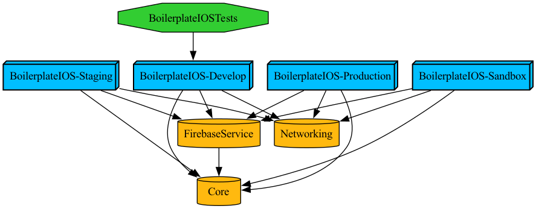

# BoilerplateIOS

A modern iOS project boilerplate built with **Tuist**, following **MVVM-C (Model-View-ViewModel-Coordinator)** architecture pattern. This template provides a solid foundation for iOS app development with best practices, multiple environments, and Firebase integration.

## 🚀 Features

- **MVVM-C Architecture**: Clean separation of concerns with Coordinator pattern
- **Multiple Environments**: Develop, Staging, Sandbox, and Production configurations
- **Firebase Integration**: Pre-configured Firebase services (Analytics, Crashlytics, Messaging, Storage, Auth)
- **Modular Structure**: Separated into Core, Networking, and FirebaseService modules
- **Tuist Project Generation**: Modern project management with Tuist
- **SwiftUI & UIKit Support**: Flexible UI framework support
- **Environment-based Configuration**: XCConfig files for each environment
- **Makefile Commands**: Convenient commands for common tasks

## 📋 Requirements

- **macOS**: 12.0 or later
- **Xcode**: 15.0 or later
- **Swift**: 5.9 or later
- **Tuist**: 4.0 or later
- **CocoaPods** (optional): For additional dependencies if needed

### Installing Tuist

```bash
# Using Homebrew
brew install tuist

# Or using the installer script
curl -Ls https://install.tuist.io | bash
```

## 📊 Dependency Graph

The project dependency graph shows the relationships between modules and external dependencies:



> Generate a new graph with: `make graph` or `tuist graph`

## 🏗️ Project Structure

```
BoilerplateIOS/
├── BoilerplateIOS/              # Main app target
│   ├── Sources/                 # App source code
│   │   ├── Coordinator/        # App coordinators
│   │   └── Views/              # SwiftUI views and ViewModels
│   └── Resources/              # App resources
├── Modules/                     # Shared modules
│   ├── Core/                   # Core framework (base classes, utilities)
│   ├── Networking/             # Networking framework (API layer)
│   └── FirebaseService/        # Firebase services wrapper
├── Configurations/              # Build configurations
│   ├── XCConfig/              # XCConfig files per environment
│   └── Firebase/              # Firebase GoogleService-Info.plist files
├── Project.swift               # Tuist project definition
├── Tuist/                      # Tuist configuration
├── Makefile                    # Convenient commands
└── setup.sh                    # Project setup script
```

## 🌍 Environments

The project supports **4 environments** with separate configurations:

| Environment | Purpose | Bundle ID Suffix | Configuration |
|-------------|---------|------------------|---------------|
| **Develop** | Development and debugging | `.develop` | Debug |
| **Staging** | Internal testing | `.staging` | Debug |
| **Sandbox** | Pre-production testing | `.sandbox` | Release |
| **Production** | Live release | (no suffix) | Release |

Each environment has:
- Separate Bundle ID (allows installing multiple versions simultaneously)
- Different API base URL
- Different Firebase project
- Different feature flags (logging, analytics, etc.)

## 🚀 Getting Started

### 1. Clone the Repository

```bash
git clone <repository-url>
cd BoilerplateIOS
```

### 2. Install Dependencies

```bash
# Install Swift Package dependencies
make install

# Or manually
tuist install
```

### 3. Generate Xcode Project

```bash
# Generate project
make generate

# Or manually
tuist generate
```

### 4. Open in Xcode

```bash
# Open workspace
make open

# Or manually
open BoilerplateIOS.xcworkspace
```

### 5. Configure Firebase

1. Go to [Firebase Console](https://console.firebase.google.com)
2. Create projects for each environment (Develop, Staging, Sandbox, Production)
3. Add iOS apps with corresponding Bundle IDs:
   - Develop: `com.tt.studio.boilerplate-ios.develop`
   - Staging: `com.tt.studio.boilerplate-ios.staging`
   - Sandbox: `com.tt.studio.boilerplate-ios.sandbox`
   - Production: `com.tt.studio.boilerplate-ios`
4. Download `GoogleService-Info.plist` for each environment
5. Replace files in `Configurations/Firebase/[Environment]/GoogleService-Info.plist`

### 6. Configure Code Signing

1. Open `Configurations/XCConfig/*.xcconfig` files
2. Uncomment and update:
   ```xcconfig
   CODE_SIGN_IDENTITY = Apple Development
   DEVELOPMENT_TEAM = YOUR_TEAM_ID
   PROVISIONING_PROFILE_SPECIFIER = YourProvisioningProfile
   ```

### 7. Update API Configuration

1. Open `Configurations/XCConfig/*.xcconfig` files
2. Update `API_BASE_URL` for each environment:
   ```xcconfig
   API_BASE_URL = https://api-dev.example.com
   ```

### 8. Build and Run

1. Select a scheme (e.g., `BoilerplateIOS-Develop`)
2. Choose a simulator or device
3. Build and run (⌘R)

## 📖 Using This Template for New Projects

### Quick Setup with Script

The easiest way to use this template for a new project:

```bash
# Run setup script
./setup.sh
```

The script will:
- ✅ Reinitialize Git repository
- ✅ Update Bundle IDs throughout the project
- ✅ Update App names
- ✅ Update Project name
- ✅ Remove Firebase configuration files (creates placeholders)
- ✅ Show next steps

### Manual Setup

If you prefer to set up manually:

#### 1. Clone and Remove Git History

```bash
git clone <boilerplate-repo-url> MyNewProject
cd MyNewProject
rm -rf .git
git init
```

#### 2. Update Project Name

Replace `BoilerplateIOS` with your project name in:
- `Project.swift` (project name)
- `Tuist/Package.swift` (package name)
- Folder name (optional, but recommended)

#### 3. Update Bundle IDs

Replace `com.tt.studio.boilerplate-ios` with your bundle ID in:
- `Project.swift`
- `Configurations/XCConfig/*.xcconfig` files

#### 4. Update App Names

Replace `Boilerplate` with your app name in:
- `Project.swift`
- `Configurations/XCConfig/*.xcconfig` files

#### 5. Configure Firebase

1. Create Firebase projects for each environment
2. Download `GoogleService-Info.plist` files
3. Replace files in `Configurations/Firebase/[Environment]/`

#### 6. Update API URLs

Edit `Configurations/XCConfig/*.xcconfig` files and update `API_BASE_URL`

#### 7. Install and Generate

```bash
make install
make generate
make open
```

## 🛠️ Available Commands

The project includes a `Makefile` with convenient commands:

### Setup & Installation
```bash
make setup          # First time setup (install + generate)
make install        # Install Swift Package dependencies
make generate       # Generate Xcode project
```

### Cleaning
```bash
make clean          # Clean Tuist cache
make clean-derived  # Clean Xcode DerivedData
make clean-spm      # Clean Swift Package Manager cache
make clean-all      # Clean all caches
make reset          # Clean everything and regenerate
```

### Building
```bash
make build-dev      # Build Develop scheme
make build-staging  # Build Staging scheme
make build-sandbox  # Build Sandbox scheme
make build-prod     # Build Production scheme
```

### Testing
```bash
make test           # Run unit tests
```

### Utilities
```bash
make open           # Open project in Xcode
make help           # Show all available commands
make info           # Show project information
make version        # Show Tuist version
```

See `make help` for the complete list of commands.

## 📦 Modules

### Core Module

Shared utilities and base classes:
- Base classes (`BaseViewModel`, `BaseViewController`)
- Coordinator protocol and extensions
- Extensions (UIView, String, Date, UIColor, Color)
- Utilities (Logger, KeychainHelper, Reusable)
- Constants (AppConstants, Environment)

### Networking Module

API layer built on Alamofire:
- `APIService`: Network request service
- `APIEndpoint`: Protocol for defining endpoints
- `APIConfiguration`: API configuration
- `NetworkError`: Custom error types

### FirebaseService Module

Firebase services wrapper:
- `FirebaseAnalyticsService`: Analytics tracking
- `FirebaseCrashlyticsService`: Crash reporting
- `FirebaseMessagingService`: Push notifications
- `FirebaseStorageService`: File storage
- `FirebaseAuthService`: User authentication

## 🏛️ Architecture

### MVVM-C Pattern

- **Model**: Data models and business logic
- **View**: SwiftUI views (or UIKit view controllers)
- **ViewModel**: Business logic and state management
- **Coordinator**: Navigation and flow management

### Coordinator Pattern

The app uses a coordinator pattern for navigation:
- `AppCoordinator`: Root coordinator managing app flow
- Feature Coordinators: Child coordinators for specific features
- Each coordinator manages its own navigation stack

📖 **See [Coordinator Pattern Guide](Documents/coordinator-guide.md) for complete documentation on:**
- How to create new Views, ViewModels, and Coordinators
- Navigation patterns (push, modal, params passing)
- When to use Child Coordinator Management, Navigation Methods, and Modal Presentation
- Best practices and troubleshooting

See `.cursorrules` for detailed architecture guidelines.

## 🔧 Configuration

### Environment Configuration

Access environment configuration in code:

```swift
import Core

// Get current environment
let env = Environment.current
print("Environment: \(env.displayName)")

// Get app configuration
let config = AppConfiguration.shared
print("API URL: \(config.apiBaseURL)")
print("Version: \(config.fullVersionString)")
```

### Conditional Compilation

Use environment-specific code:

```swift
#if DEVELOP
    // Development-only code
#elseif PRODUCTION
    // Production-only code
#endif
```

## 📚 Documentation

- [Coordinator Pattern Guide](Documents/coordinator-guide.md) - Complete guide to using Coordinator pattern (MVVM-C)
- [Configurations README](Configurations/README.md) - Environment configuration guide
- [Firebase README](Configurations/Firebase/README.md) - Firebase setup guide
- [Core Module README](Modules/Core/README.md) - Core module documentation
- [Networking Module README](Modules/Networking/README.md) - Networking module documentation
- [FirebaseService README](Modules/FirebaseService/README.md) - Firebase services documentation
- [Cursor Rules](.cursorrules) - Architecture and coding guidelines

## 🤝 Contributing

1. Fork the repository
2. Create a feature branch
3. Make your changes
4. Submit a pull request

## 📄 License

[Add your license here]

## 🙏 Acknowledgments

- [Tuist](https://tuist.io) - Project generation tool
- [Alamofire](https://github.com/Alamofire/Alamofire) - HTTP networking library
- [Firebase](https://firebase.google.com) - Backend services

## 📞 Support

For issues and questions:
- Open an issue on GitHub
- Check the documentation in each module's README
- Review the `.cursorrules` file for architecture guidelines

---

**Happy Coding! 🎉**

